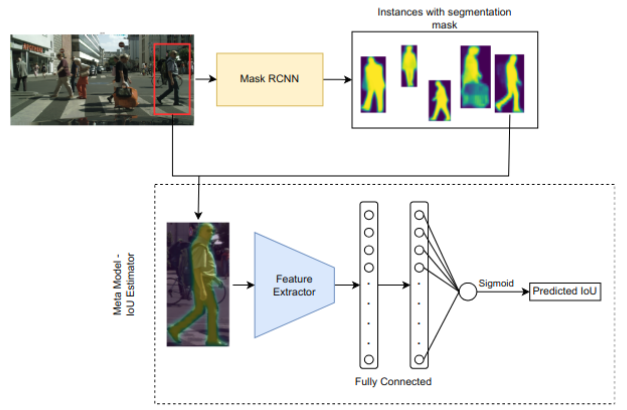
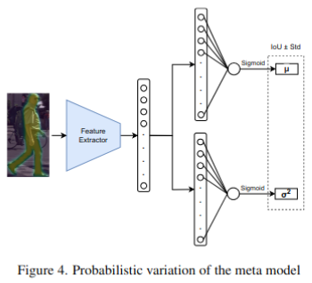

# meta-model-uncertainty 

Companion code for the paper "Exploring the Efficacy of task-specific Meta-Models as run-time Predictive Uncertainty Indicators"

## ABSTRACT
In computer vision, instance segmentation is a high-level task that involves detecting objects in an image and precisely delineating each object instance with a pixel-wise mask. This work investigated the feasibility of employing a secondary task-specific model as a predictive uncertainty estimator. We trained a performance-predicting meta-model to predict the quality of segmentation masks based on input images and masks. Our experiments demonstrate that the meta-regression model showcases a reasonable estimation (0.77 R2-Score) of Mask Intersection over Union (IoU) compared to the actual metric. Our experiments included testing meta-models with different architectural settings and loss functions. We also applied probabilistic mean-variance estimation networks to our task. Among these, a model with a ResNet50 feature extractor trained with MSE ($\ell_{2}$) criterion performed the best. However, an intriguing observation was made: uncertainty estimates (variance) exhibited a moderate, albeit nonlinear, correlation with the residual error of predicted uncertainty. These findings contribute to the evolving landscape of computer vision by shedding light on the potential of meta-models for predictive uncertainty estimation in instance segmentation, urging further exploration and refinement.


### Installation
The environment.yml file can be used to clone the conda environment used for the development of this project, following the instruction below.

```
>> conda env create --file environment.yml
>> conda activate s2l8h
```

### In-a-nutshell
We trained a performance (mask IoU) predicting meta-model that works in a black box manner.
The model takes the image and the predicted segmentation mask as input and outputs a meta-IoU score.
A deep mean-variance estimation network is applied for probabilistic extension of the meta-model which predicts a mean point estimate along with a confidence interval representing the predictive variance.
 .

### 